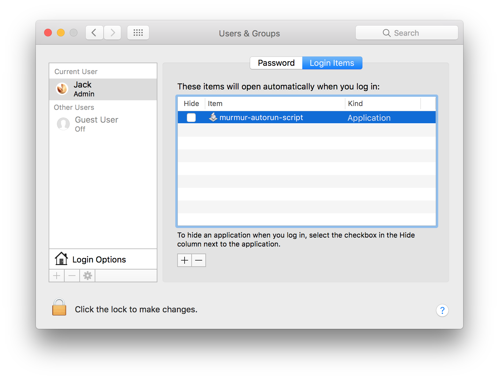

# Murmur - setup guide

## 1 - Write IMG file to microSDHC for Raspberry 
Write the zip file of the Raspberry IMG of Murmur to the microSDHC.  
Use the Kingston microSDHC Class 10 16GB and the application [Etcher](https://etcher.io/).  
[List of the SD cards compatibles with RPi](https://elinux.org/RPi_SD_cards)

## 2 - Generate and install SSH key

### 1 - Generate a new SSH key on your computer
- Check if an SSH key already exists with the command `ls ~/.ssh`  
If you see files named named `d_rsa.pub` or `id_dsa.pub` you already have a key setup. Then, you can skip the step 'Generate a new SSH key on your computer' (or delete these files with `rm id*` and create a new key).

- Generate new SSH key
	- Write the command `ssh-keygen -t rsa -C <YOURNAME>@<YOURDEVICE>` for example `ssh-keygen -t rsa -C murmur@pi` 
	- Upon entering this command, you'll be asked where to save the key. We suggest you save it in the default location `/home/pi/.ssh/id_rsa` by just hitting  `Enter`
	- You'll also be asked to enter a passphrase. Leave the field empty for no passphrase and hit `Enter` two times

- Check if the key has been created using the command `ls ~/.ssh`  	
Now you should see the files `id_rsa` and `id_rsa.pub` in your .ssh directory in your home folder:

>	```java
>	ls ~/.ssh
>	id_rsa  id_rsa.pub
>	```

### 2 - Copy your public key to your Raspberry Pi
- First of all, connect your Raspberry with the ethernet cable to the router, and with a second ethernet cable connect your computer to that same router
- Use the application [IP Scanner](https://itunes.apple.com/us/app/ip-scanner/id404167149?mt=12) and write down the IP address of the Raspberry
- To copy your public key to your Raspberry Pi, use the following command `cat ~/.ssh/id_rsa.pub | ssh <YOURDEVICE>@<IP-ADDRESS> 'cat >> .ssh/authorized_keys'`  
for example `cat ~/.ssh/id_rsa.pub | ssh pi@192.168.1.126 'cat >> .ssh/authorized_keys'`
- Answer `yes` when the Terminas asks `The autehncity of host <IP-ADDRESS> can't be stablished ... Are you sure you want to continue?`
- Authenticate with your password `raspberry`
- Now, if you write the command `ls ~/.ssh` you should see the new file `known_hosts`

>	```java
>	ls ~/.ssh
>	id_rsa  id_rsa.pub  `known_hosts`
>	```

### 3 - Login into the Raspberry Pi using the SSH key
Use the command `ssh pi@<IP-ADDRESS>` and hit `Enter` to login into the Raspberry.  
Because the SSH key has been created on the computer and installed into the Raspberry, the login should be done without password (the first time the Terminal might ask you `add  raspberrypi.local to known hosts?` hit `yes` and if it ask you to enter the passfrase, just hit `Enter`).

**Note**
If when you are login into the Raspberry you receive that message `WARNING: REMOTE HOST IDENTIFICATION HAS CHANGED!` follow this step by step:
- Open the file `/Users/chevalvert/.ssh/known_hosts` with TextEdit
- Erase the text of the file
- Copy again the SSH key into your Raspberry

## 3 - Configuration of the IP adresses
To make communication between the computer and the Raspberry possible, the IP addresses must be configured and saved in the configuration files of the Murmur program (both in the computer and in the Raspberry). For this it is necessary to connect the computer and the Raspberry to the router with 2 cables ethernet.

### 1 - On the computer
- Turn Wi-Fi off
- Connect the computer to the router by ethernet
- Within `System preferences > Network` verify that ethernet connection is set in mode DHCP
- Open the application IP Scanner and write down the IP adresses of the computer (local user 192.168.1.33) and Raspberry (192.168.1.2)
- Open the file `yourmurmurappfolder/data/configuration.xml` with TextEdit, write down the Raspberry's IP address, save and close the file 

>	```java
>	<!-- Raspberry -->
>    <launchDevices pathScriptRun="/home/pi/openFrameworks/apps/myApps/murmurRaspberry/bin/run_murmur.sh">   	
>        <ip>192.168.1.2</ip>		
>   </launchDevices>
>   ```

### 2 - On the Raspberry
- Login to the Raspberry using the application Cyberduck on the computer
	- SFTP (SSH File Transfer Protocol)
	- Server : Raspberry's IP address
	- username : pi
	- password : raspberry
- Open the file `pi/openFrameworks/apps/myApps/murmurRaspberry/bin/data/configuration.xml` with TextEdit and write down the computer's IP adress (local user), save and close  
- For enabling the Autorun mode you must enable the executable mode of the file  `pi/openFrameworks/apps/myApps/murmurRaspberry/bin/run_murmur.sh` by right click > info > permissions execute
- To balance the microphone use the command line to login to the Raspberry `ssh pi@<IP-ADDRESS>` then command `alsamixer` 

Now the computer and Murmur program on Raspberry know their IP addresses and can communicate.

## 3 - Run Murmur in installation mode
- Open the file `yourmurmurappfolder/data/configuration.xml` with TextEdit and disable the simulation mode writing 0 in `<enable>0</enable>`
- Run Murmur program `yourmurmurappfolder/murmur`. The light on the stripLED and the video projections should react according to the sound of your voici (both in the Murmur interface program and on the installation). If it is not reacting properly check that the fonction `Configuration > Launch murmur@rasp` is checked.

## 4 - SD card backup of the configuration installed in the exhibition venue
Once the installation of Murmur in the exhibition venue is finished and before the opening, we highly recommend to create an SD card backup (IMG file)
- Insert the microSD card in the computer
- Open the terminal and hit the command `diskutil list` and note the name of the microSD card 
- Generate the SDcard IMG and copy it to your computer with the command `sudo dd if=/dev/rdisk2 of=/Users/chevalvert/Desktop/180328-murmur.img bs=1m`
- Wait until the SD card has been completely read and copied to your computer. The command does not show any feedback, so wait for the command prompt to reappear in the terminal window once it is complete. The SD is a 32 GB, this process might take some hours to be completed. Meanwhile you can verify how much bytes have been transferred using the command `ctrl + T`


## 5 - Autorun app script
In order to let de video projector beeing detected by the computer, we have to wait about 20 seconds before running Murmur app. 

To run Murmur app automatically after those 20 seconds we have to create an script-application. 

> ```java
> delay 20
> launch application "/Users/Jack/Desktop/180528-Murmur/murmur.app"
> ```

With Script Editor (Applications > Utilities) create a script with this content
then export it as an application and configure it to login automatically when the computer boots.



# Murmur - guide d'installation (FR)

## 1 - Écrire l’image disque sur microSDHC pour Raspberry
Installer le zip de l'image Raspberry de Murmur sur la carte microSD.  
Utiliser une carte Kingston microSDHC Class 10 16GB et l'application [Etcher](https://etcher.io/) pour flasher l'image sur la carte SD.  
[Liste des cartes SD compatibles avec RPi](https://elinux.org/RPi_SD_cards)  

## 2 - Création et installation des clés SSH

### 1 - Générer une clé SSH sur l'ordinateur
- Vérifier s'il existent déjà des clés SSH avec la commande `ls ~/.ssh`  
S'il y a des fichiers nommés `d_rsa.pub` ou `id_dsa.pub` la clé existe déjà. Vous pouvez sauter le pas "Générer une nouvelle clé SSH" (ou supprimer ces fichiers avec la commande `rm id*` et générer une nouvelle clé).

- Générer une nouvelle clé SSH
	- Écrire la commande `ssh-keygen -t rsa -C <YOURNAME>@<YOURDEVICE>` par exemple `ssh-keygen -t rsa -C murmur@pi` 
	- Lors de la demande 'où sauvegarder la clé?' choisissez la proposition par défaut `/home/pi/.ssh/id_rsa` en tappant `Enter`
	- N'écrivez pas de password, appuyez deux fois sur `Enter`

- Vérifier que la clé a été créée avec la commande `ls ~/.ssh`  	
S'il y a des fichiers nommés `d_rsa.pub` ou `id_dsa.pub` la clé a bien été créée :
>	```java
>	ls ~/.ssh
>	authorized_keys  id_rsa  id_rsa.pub  known_hosts
>	```

### 2 - Copier la clé publique SSH sur la Raspberry Pi
- Tout d'abord, connecter par ethernet la Raspberry et l'ordinateur sur le router
- Utiliser l'application [IP Scanner](https://itunes.apple.com/us/app/ip-scanner/id404167149?mt=12) et noter l'adresse IP de la Raspberry
- Pour copier la clé sur la Raspberry utiliser la commande `cat ~/.ssh/id_rsa.pub | ssh <YOURDEVICE>@<IP-ADDRESS> 'cat >> .ssh/authorized_keys'`  
par exemple `cat ~/.ssh/id_rsa.pub | ssh pi@192.168.1.126 'cat >> .ssh/authorized_keys'`
- Répondre `yes` quand le Terminas demande `The autehncity of host <IP-ADDRESS> can't be stablished ... Are you sure you want to continue?`
- Autentifier le login avec le password `raspberry`
- Maintenant avec la commande `ls ~/.ssh` le fichier `known_hosts` devrait apparaître

>	```java
>	ls ~/.ssh
>	id_rsa  id_rsa.pub  `known_hosts`
>	```

### 3 - Connexion à la Raspberry Pi en utilisant la clé SSH
Utiliser la commande `ssh pi@<IP-ADDRESS>` et `Enter` pour se connecter à la Raspberry.  
Puisque la clé SSH a été installée, la connexion devrait pouvoir se faire sans demande de password (la première fois le Terminal peut vous demander `add  raspberrypi.local to known hosts?` choisisez `yes` et s'il vous demande le password appuyez sur `Enter`).

**Note**
Si, lors de la connexion sur la Raspberry le Terminal vous renvoie un message `WARNING: REMOTE HOST IDENTIFICATION HAS CHANGED!` suivez ce pas à pas :
- Ouvrez le fichier `/Users/chevalvert/.ssh/known_hosts` avec TextEdit
- Effacez le contenu du fichier texte
- Copiez à nouveau la clé publique SSH sur la Raspberry

## 3 - Configuration des adresses IP
Pour rendre possible la communication entre l'ordinateur et la Raspberry il faut configurer et renseigner les adresses IP dans les fichiers de configuration du programme Murmur (dans l'ordinateur et dans la Raspberry). Pour cela il faut connecter l'ordinateur et la Raspberry au router avec 2 câbles ethernet.

### 1 - Sur l'ordinateur
- Éteindre le wifi
- Connecter l'ordinateur au routeur par ethernet 
- Dans `System preferences > Network` vérifier que la connexion ethernet est en mode DHCP
- Ouvrir l'application IP Scanner et noter les adresses IP de l'ordinateur (local user 192.168.1.33) et de la Raspberry (192.168.1.2)
- Ouvrir le fichier `yourmurmurappfolder/data/configuration.xml` avec TextEdit, signaler l'adresse IP de la Raspberry, sauvegarder et fermer 

>	```java
>	<!-- Raspberry -->
>    <launchDevices pathScriptRun="/home/pi/openFrameworks/apps/myApps/murmurRaspberry/bin/run_murmur.sh">   	
>        <ip>192.168.1.2</ip>		
>   </launchDevices>
>   ```

### 2 - Sur la Raspberry
- Se connecter à la Raspberry en utilisant l'application Cyberduck de l'ordinateur
	- SFTP (SSH File Transfer Protocol)
	- Server : addresse IP de la Raspberry
	- username : pi
	- password : raspberry
- Ouvrir le fichier `pi/openFrameworks/apps/myApps/murmurRaspberry/bin/data/configuration.xml` avec TextEdit et signaler l'adresse IP de l'ordinateur (local user), sauvegarder et fermer  
- Pour que l'autorun puisse avoir lieu rendre le fichier  `pi/openFrameworks/apps/myApps/murmurRaspberry/bin/run_murmur.sh` exécutable en faisant click droit > info > permissions execute
- Pour faire la balance du microphone utiliser le terminal pour se connecter à la Raspberry `ssh pi@<IP-ADDRESS>` puis `alsamixer` 

À présent l'ordinateur et le programme Murmur de la Raspberry connaissent leurs adresses IP et peuvent communiquer.

## 3 - Lancer Murmur en mode installation
- Ouvrir le fichier `yourmurmurappfolder/data/configuration.xml` avec TextEdit et désactiver le mode simulation en écrivant 0 dans `<enable>0</enable>`
- Lancer le programme murmur `yourmurmurappfolder/murmur`. Le stripLED et les projections doivent réagir à la voix (dans le simulateur et dans l'installation). Sinon vérifier que dans l'onglet Configuration la fonction `Launch murmur@rasp` est bien cochée.

## 4 - Créer une image SD de la configuration installée
Une fois l'installation de Murmur est terminée, avant d'ouvrir au public, il faut créer une image la carte microSD
- Insérer la carte microSD dans le lecteur de l'ordinateur
- Sur le Terminal utiliser la commande `diskutil list` pour repérer le nom de la carte 
- Utiliser la commande pour générer l'image `sudo dd if=/dev/rdisk2 of=/Users/chevalvert/Desktop/180328-murmur.img bs=1m`
- Attendre jusqu'à ce que le process soit fini (lorsque le command prompt réapparaît sur le Terminal). Pour les cartes SD de 16 et 32 GB le process peut prendre du temps, utiliser la commande pour vérifier les bytes qui ont été transférés `ctrl + T`

## 5 - Autorun app script
In order to let de video projector beeing detected by the computer, we have to wait about 20 seconds before running Murmur app. 

To run Murmur app automatically after those 20 seconds we have to create an script-application. 

> ```java
> delay 20
> launch application "/Users/Jack/Desktop/180528-Murmur/murmur.app"
> ```

With Script Editor (Applications > Utilities) create a script with this content
then export it as an application and configure it to login automatically when the computer boots.


## License
[MIT.](https://tldrlegal.com/license/mit-license)